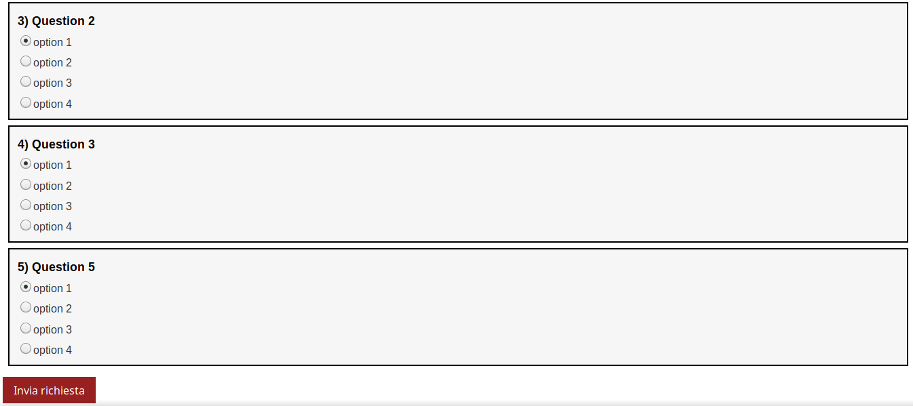
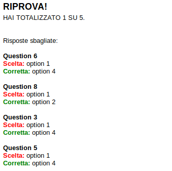

# Javascript-Quiz
## Table of contents
* [General info](#general-info)
* [Technologies](#technologies)
* [Setup](#setup)
* [Launch](#launch)
* [Example of use](#example-of-use)

## General info
This project is a simple JavaScript quiz with answer correction and score.

The software picks a certain number of random questions from a bigger list
previously written, then prints the quiz.
Finally, prints the score and the correction of the wrong answers.
	
## Technologies
Project is created with:
* HTML
* CSS
* JavaScript
	
## Setup
Since is a JavaScript project, you just need to enable JavaScript
on your browser.

If you want to edit the questions in the quiz, you need to open
**js-quiz-questions.js** to do so, the structure is very basic:

```
var myquestions = [
  {
    q : "Question 1", //q stands for question, insert here your sentence/question.
    o : [             //o stands for options, put here the answer options.
      "option 1",
      "option 2",
      "option 3",
      "option 4"
    ],
    a : 0             //a stands for answer, put here the index of the correct option.
                      //(array starts with 0)
                      //EXAMPLE: a : 0 means that the correct answer is "option 1"
  }
  .
  .
  .
  ]
  ```
  If you want to modify the number of random questions picked, just open **js-quiz.js**
  and modify **QUESTIONS_NUM** variable.
  
  ## Launch
  To run this project, just click on **js-quiz.html**, so simple!
  
  ## Example of use
  Once launched, complete the quiz selecting the radio buttons and hit submit:
  
  
  then you should get the score and the corrections of the wrong answers:
  
  
